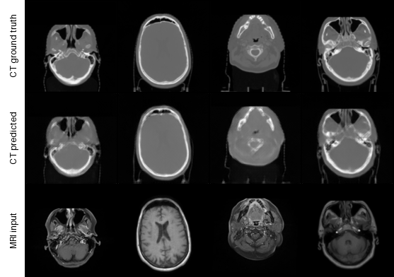

# MRI-to-CT Translation with Shared-Latent VQ-VAE and Latent Diffusion

PyTorch code for **MRI-to-CT image translation** using a two-stage latent generative pipeline. The project first learns MRI/CT representations with a VQ-VAE-style autoencoder and then trains a conditional latent diffusion model to synthesize CT latents from MRI. The diffusion U-Net supports early MRI conditioning by latent concatenation and bottleneck cross-attention.

## Method

1. **Shared-latent VQ-VAE** — learns compact MRI and CT representations and explores shared/private latent structure across the two modalities.
2. **Conditional latent diffusion** — corrupts the CT latent with diffusion noise and predicts the denoising direction while conditioning on the MRI latent.
3. **MRI cross-attention** — projects the MRI latent into the U-Net bottleneck and uses multi-head cross-attention in addition to input concatenation.
4. **CT reconstruction** — the denoised CT latent is decoded back to image space with the CT decoder.

## Sample MRI → CT result

## References

- Rombach, R., Blattmann, A., Lorenz, D., Esser, P., & Ommer, B.  
  **High-Resolution Image Synthesis with Latent Diffusion Models.** CVPR, 2022.  
  https://github.com/CompVis/latent-diffusion

- Märtens, K. et al.  
  **Shared-Private Multimodal VAE.**  
  https://github.com/kasparmartens/shared-private-multimodalVAE

- Zuo, Z., Zhao, L., Wang, Z., Xing, W., Chen, H., Lu, D., et al.  
  **Multimodal Image-to-Image Translation via Mutual Information Estimation and Maximization.**  
  arXiv:2008.03529, 2021.

- **Mutual Information Guided Diffusion for Zero-Shot Cross-Modality Medical Image Translation.**

- Chen, X., Duan, Y., Houthooft, R., Schulman, J., Sutskever, I., & Abbeel, P.  
  **InfoGAN: Interpretable Representation Learning by Information Maximizing Generative Adversarial Nets.**  
  NeurIPS, 2016.

- Wang, Y., Schiff, Y., Gokaslan, A., Pan, W., Wang, F., De Sa, C., & Kuleshov, V.  
  **InfoDiffusion: Representation Learning Using Information Maximizing Diffusion Models.**  
  ICML, 2023.

- ExplainingAI.  
  **Stable Diffusion from Scratch in PyTorch.**  
  https://github.com/explainingai-code/StableDiffusion-PyTorch
